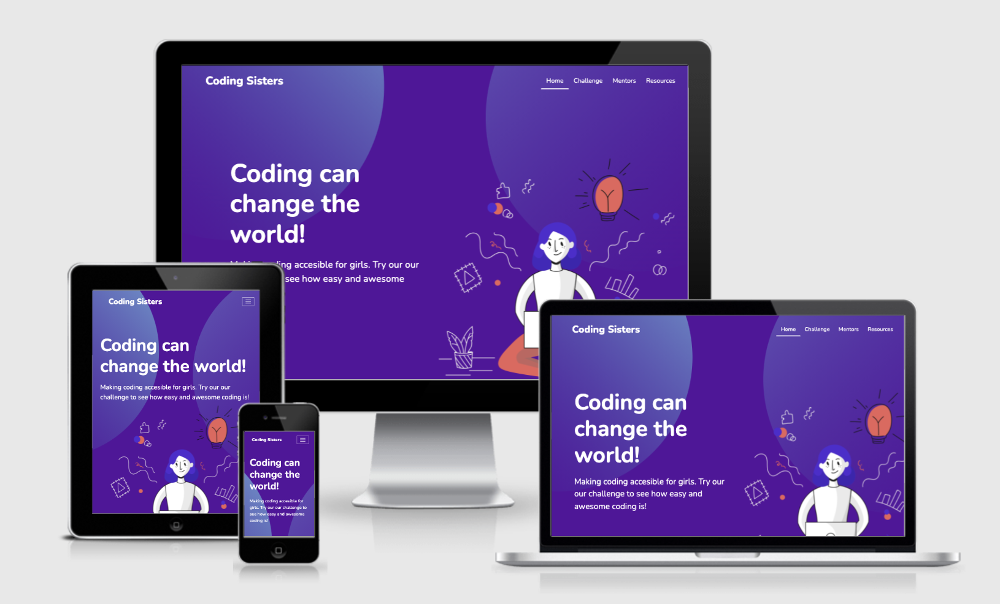

# **Coding Sisters**

[View live version of website via GitHub Pages](https://franciskadtt.github.io/women-in-tech-hackathon/)

Our Team took part in a Code Institute Hackathon where we had to design and executed a coding project in a team. We were four team members that had to work together to build a project based on an assigned theme: Empower and enable Women and Girls to Thrive in the world of coding. We build a website to inspire and empower young girls (age 9-12) to learn about the world of coding through a mentor program, a quiz, a role model section and some extra resources.

The team members for this project was: Teema Namdarian, Mario Gusman, Isabelle Ängsås, and Franciska Du Toit under the guidance of our mentor, Tim Nelson.

## Credits

### Media
* Images of female coders in the rolemodels section are from [Wikimedia Commons](https://commons.wikimedia.org/wiki/Main_Page)
* Drawn portrait of anonymous woman in rolemodels section is from [Canva Design](https://www.canva.com/)
* Illustrations from [UI8](https://ui8.net/pixel-true-designs/products/70-beautiful-free-illustrations
)

### Code 
* Code for flipping card effect with CSS is found at [W3 Schools](https://www.w3schools.com/howto/howto_css_flip_card.asp)
* Code for talk bubbleis found at [CodePen](https://codepen.io/Founts/pen/gmhcl)
